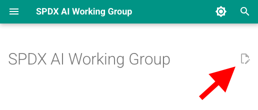

# SPDX AI Working Group

The SPDX AI Working Group develops and maintains the AI and Dataset profiles of
the System Package Data Exchange™ (SPDX®) specification.

We create standards for documenting AI systems and datasets to improve
safety, transparency, and compliance through standardized Bill of Materials
(BOM) practices.

This repository hosts sources for the SPDX AI Working Group website,
which contains information about our work and work in progress.
Visit our website at: <https://spdxai.github.io/>

*This is not the official SPDX website.*
*For official SPDX information, please visit <https://spdx.dev/>.*

## Contributing

We welcome contributions!

The easiest way to edit any existing page on the website,
is to click on the "Edit this page" icon at the top right of each page.



If you'd like to improve the website or add content:

1. Fork the repository
2. Create a new branch for your changes
3. Make your changes
4. Submit a pull request

Once the pull request is merged to the `main` branch,
the changes will be automatically deployed to the live website.

## Setup the website

This site uses MkDocs with the Material theme. It requires Python 3.10+.

1. Clone and enter the repo:

    ```bash
    git clone https://github.com/spdxai/spdxai.github.io.git
    cd spdxai.github.io
    ```

1. Install dependencies:

    ```bash
    pip install -r requirements.txt
    ```

1. Get the website:

    Start the development server:

    ```bash
    mkdocs serve
    ```

    Then open `http://127.0.0.1:8000/` in your browser.

    Or build the static site with:

    ```bash
    mkdocs build
    ```

    The built site will be in the `site/` directory.

## License

See the [LICENSE](LICENSE) file for details.
