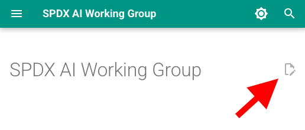

# Working Group Website Template

This repository is a template for technical working group websites built with
[MkDocs](https://www.mkdocs.org/) and the
[Material for MkDocs](https://squidfunk.github.io/mkdocs-material/) theme,
deployed to GitHub Pages via GitHub Actions.

## Using this template

### Step 1: Create your repository from this template

1. Click **"Use this template"** on GitHub to create a new repository
2. Name your repository `YOUR-ORG.github.io` (for a GitHub Pages organization site)
   or any name you prefer

### Step 2: Enable GitHub Pages

1. Go to your repository's **Settings → Pages**
2. Under **Source**, select **GitHub Actions**

### Step 3: Customize the site

Search for `[CUSTOMIZE]` and `TODO` comments throughout the files.
The main places to update are:

| File                 | What to update                                      |
| -------------------- | --------------------------------------------------- |
| `mkdocs.yml`         | Site name, description, URL, repository URL, colors |
| `docs/index.md`      | Homepage content                                    |
| `docs/work.md`       | Technical work and deliverables                     |
| `docs/resources.md`  | Useful resources and examples                       |
| `docs/news.md`       | Publications and presentations                      |
| `docs/contribute.md` | Meeting schedule and community channels             |

### Step 4: Add your logo (optional)

- Place a `logo.svg` in `docs/img/` and update `mkdocs.yml` to use `logo: img/logo.svg`
- Or keep the default Material icon (`icon.logo: material/home`)
- Replace `docs/img/favicon.png` with your own to customize the browser tab icon

### Step 5: Remove placeholder pages you don't need

If your working group doesn't need all pages (e.g., no "Resources" or "News" page),
delete the corresponding files and remove the entries from the `nav` section in `mkdocs.yml`.

## Contributing to this site

The easiest way to edit a page is to click the **"Edit this page"** icon
at the top right of any page on the live website.



To make larger changes:

1. Fork the repository
2. Create a new branch for your changes
3. Make your changes
4. Submit a pull request

Once merged to `main`, changes are automatically deployed to the live website.

## Local setup

This site uses MkDocs with the Material theme. It requires Python 3.10+.

1. Clone and enter the repo:

    ```bash
    git clone https://github.com/YOUR-ORG/YOUR-REPO.git
    cd YOUR-REPO
    ```

1. Install dependencies:

    ```bash
    pip install -r requirements.txt
    ```

1. Start the development server:

    ```bash
    mkdocs serve
    ```

    Then open `http://127.0.0.1:8000/` in your browser.

    Or build the static site:

    ```bash
    mkdocs build
    ```

    The built site will be in the `site/` directory.

## License

See the [LICENSE](LICENSE) file for details.
