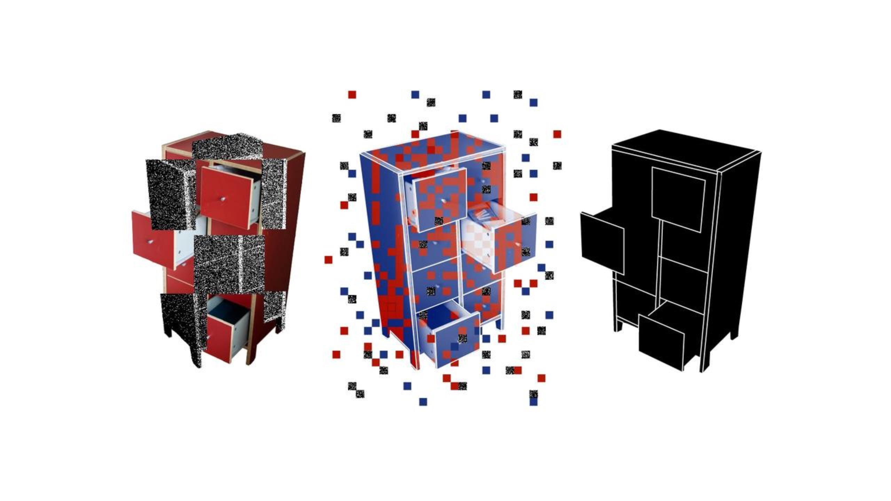

# SPDX AI Working Group



The **SPDX AI Working Group** is a technical working group for the
[AI area of interest][spdx-ai], within the
[System Package Data Exchange™ (SPDX®) project][spdx-project],
dedicated to creating standards for documenting artificial intelligence systems
and datasets in a standardized format.

[Our works](./publications.md) enable safety, transparency, and compliance
in AI development through standardized bill of materials (BOM) practices.

## Mission

Our mission is to:

- Develop and maintain AI and Dataset profiles for
  [SPDX specification][spdx-spec]
- Create comprehensive documentation and examples
- Facilitate collaboration among industry stakeholders
- Promote best practices for AI transparency and accountability

## Key areas of work

### AI profile

The [AI profile][ai-profile] defines how to document AI/ML models, including:

- Model architecture and parameters
- Training data and methodologies
- Performance metrics and evaluation
- Dependencies and runtime requirements

### Dataset profile

The [Dataset profile][dataset-profile] specifies how to document datasets,
including but not limited to the usages in AI/ML systems:

- Data sources and provenance
- Data collection and processing methods
- Data quality and statistics
- Licensing and usage restrictions

Here's a minimal example of an SPDX 3.0 AIPackage shown in
two formats — JSON and RDF/Turtle.
Use the tabs to switch between representations.

=== "JSON"

    ```json
    {
      "@context": "https://spdx.org/rdf/3.0/spdx-context.jsonld",
      "@graph": [
        {
          "type": "ai_AIPackage",
          "spdxId": "https://example.org/model-abc123",
          "name": "sentiment-classifier",
          "creationInfo": {
            "type": "CreationInfo",
            "created": "2025-01-15T10:00:00Z",
            "createdBy": [ "https://example.org/agent/ai-team" ]
          },
          "software_packageVersion": "1.1.2",
          "software_primaryPurpose": "model",
          "software_downloadLocation": "https://github.com/example.org/model-abc/",
          "ai_domain": [
            "sentiment analysis",
            "natural language processing"
          ],
          "ai_energyConsumption": {
            "type": "ai_EnergyConsumption",
            "ai_inferenceEnergyConsumption": [
              {
                "ai_energyQuantity": "0.0000036",
                "ai_energyUnit": "kilowattHour",
                "type": "ai_EnergyConsumptionDescription"
              }
            ]
          },
          "ai_hyperparameter": [
            {
              "type": "DictionaryEntry",
              "key": "epoch",
              "value": "100"
            }
          ],
          "ai_metric": [
            {
              "type": "DictionaryEntry",
              "key": "f1",
              "value": "0.4669192"
            }
          ]
        }
      ]
    }
    ```

=== "Turtle"

    ```turtle
    @prefix spdx: <https://spdx.org/rdf/3.0.1/terms/Core/> .
    @prefix spdx-sw: <https://spdx.org/rdf/3.0.1/terms/Software/> .
    @prefix spdx-ai: <https://spdx.org/rdf/3.0.1/terms/AI/> .
    @prefix xsd: <http://www.w3.org/2001/XMLSchema#> .

    <https://example.org/model-abc123>
        a spdx-ai:AIPackage ;
        spdx:spdxId "https://example.org/model-abc123" ;
        spdx:name "sentiment-classifier" ;
        spdx-sw:packageVersion "1.1.2" ;
        spdx-sw:primaryPurpose "model";
        spdx-sw:downloadLocation <https://github.com/example.org/model-abc/> ;
        spdx-ai:domain "sentiment analysis", "natural language processing" ;
        spdx-ai:energyConsumption [
            a spdx-ai:EnergyConsumption ;
            spdx-ai:inferenceEnergyConsumption [
                a spdx-ai:EnergyConsumptionDescription ;
                spdx-ai:energyQuantity "0.0000036"^^xsd:decimal ;
                spdx-ai:energyUnit "kilowattHour"
            ]
        ] ;
        spdx-ai:hyperparameter [ a spdx:DictionaryEntry ; spdx:key "epoch" ; spdx:value "100" ] ;
        spdx-ai:metric [ a spdx:DictionaryEntry ; spdx:key "f1" ; spdx:value "0.4669192" ] .
    ```

SPDX AI and Dataset profiles can be used to comprehensively document AI systems
and datasets, on top of the existing software component information that
the core SPDX specification provides.

See more examples in the [Examples](./examples.md) section.

Want to improve this? See [Contribute](./contribute.md) section.

[spdx-ai]: https://spdx.dev/learn/areas-of-interest/ai/
[spdx-project]: https://spdx.dev/
[spdx-spec]: https://spdx.org/specifications/
[ai-profile]: https://spdx.github.io/spdx-spec/latest/model/AI/AI/
[dataset-profile]: https://spdx.github.io/spdx-spec/latest/model/Dataset/Dataset/

---

["Classification Cupboard"](https://betterimagesofai.org/images?artist=AntonGrabolle&title=ClassificationCupboard)
illustration by [Anton Grabolle](https://www.instagram.com/miss.tonton/) /
<https://betterimagesofai.org> / [Licenced by CC-BY 4.0](https://creativecommons.org/licenses/by/4.0/)
