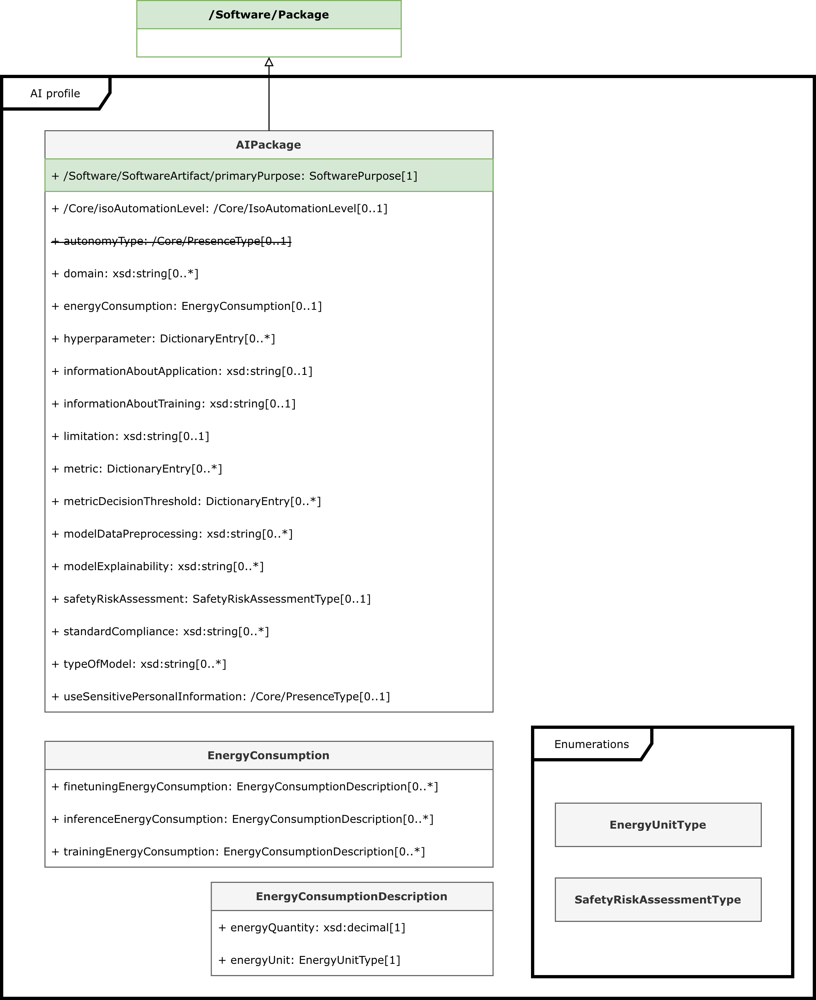
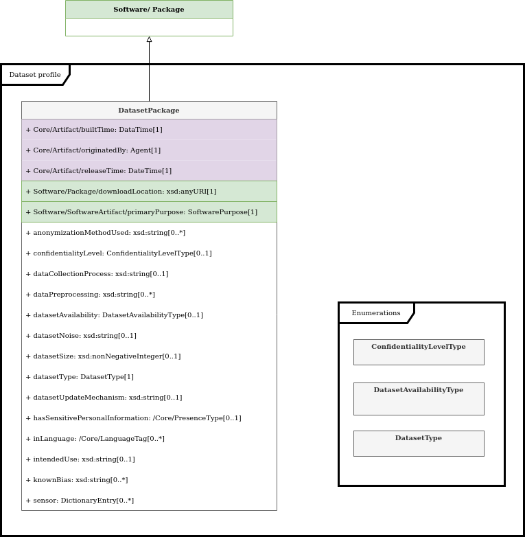

# Profiles overview

## AI profile

[AI profile][ai-profile]

## Dataset profile

[Dataset profile][dataset-profile]

## SBOM example

An overview of an AI package, from the AI BOM in [AI Example 02][ai-ex-02]
(click on the diagram to enlarge):

Details of some information categories that the AI BOM captures:

See more examples in the [Examples](./examples.md) section.

---

[Back to Home](./index.md){ .md-button }

[ai-profile]: https://spdx.github.io/spdx-spec/latest/model/AI/AI/
[dataset-profile]: https://spdx.github.io/spdx-spec/latest/model/Dataset/Dataset/
[ai-ex-02]: https://github.com/spdx/spdx-examples/tree/master/ai/example02
